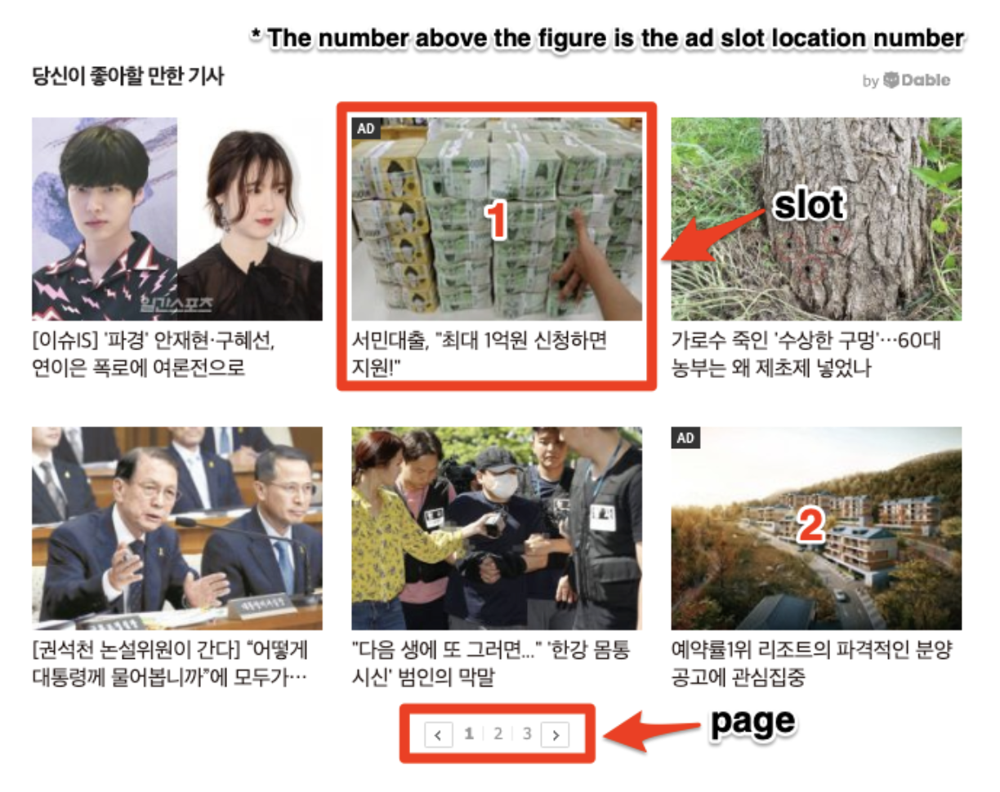

# Dable-RTB-Integration-Guide

* [1. Overview](#1-overview)
    * [1.1 Summary](#11-summary)
    * [1.2 Base Open RTB Specification](#12-base-open-rtb-specification)
    * [1.3 Basic Auction on the Dable Exchange](#13-basic-auction-on-the-dable-exchange)
    * [1.4 RTB Server-To-Server Protocol](#14-rtb-server-to-server-protocol)

* [2. Important Integration Notes](#2-important-integration-notes)
    * [2.1 Note regarding impression tracking](#21-note-regarding-impression-tracking)
    * [2.2 Multiple bid responses and multiple seat bids](#)
    * [2.3 OpenRTB Native Specification](#)

* [3. Dable BidRequest Specification](#3-dable-bidrequest-specification)
    * [3.1 Object: BidRequest](#31-object-bidrequest)
    * [3.2 Object: Regs](#32-object-regs)
    * [3.3 Object: Imp](#33-object-imp)
        * [3.3.1 imp.ext](#331-impext)
    * [3.4 Object: Metric](#34-object-metric)
    * [3.5 Object: Native](#35-object-native)
    * [3.6 Object: Site](#36-object-site)
    * [3.7 Object: Publisher](#37-object-publisher)
    * [3.8 Object: Content](#38-object-content)
        * [3.8.1 content.ext](#381-contentext)
    * [3.9 Object: Device](#39-object-device)
    * [3.10 Object: User](#310-object-user)

* [4. Dable BidResponse Specification](#4-dable-bidresponse-specification)
    * [4.1 Object: BidResponse](#41-object-bidresponse)
    * [4.2 Object: Seatbid](#42-object-seatbid)
    * [4.3 Object: Bid](#43-object-bid)
    * [4.4 Object: Asset Response Object](#44-object-asset-response-object)
        * [4.4.1 Image Response Object](#441-image-response-object)
        * [4.4.2 Data Response Object](#442-data-response-object)
    * [4.5 Substitution Macros](#45-substitution-macros)

* [5. Native](#5-native)
    * [5.1 Request for Bid](#51-request-for-bid)
        * [5.1.1 Native Markup Request Object](#511-native-markup-request-object)
        * [5.1.2 native.request.assets](#512-nativerequestassets)
            * [5.1.2.1 Title Request Object](#5121-title-request-object)
            * [5.1.2.2 Image Request Object](#5122-image-request-object)
            * [5.1.2.3 Data Request Object](#5123-data-request-object)
        * [5.1.3 Event Trackers Request Object](#513-event-trackers-request-object)
    * [5.2 Response for Bid](#52-response-for-bid)
        * [5.2.1 Native Markup Response Object](#521-native-markup-response-object)
    * [5.3 Substitution Macros](#53-substitution-macros)

* [6. Enumerated Lists Specification](#6-enumerated-lists-specification)
    * [6.1 Lists: OpenRTB 2.5 Spec](#61-lists-openrtb-25-spec)
    * [6.2 Lists: Native Subspec](#62-lists-native-subspec)
        * [6.2.1 Data Asset Types](#621-data-asset-types)
        * [6.2.2 Image Asset Types](#622-image-asset-types)
        * [6.2.3 Event Types Table](#623-event-types-table)

* [7. Contents Checking Process](#7-contents-checking-process)
    * [7.1 Contents Post-checking](#71-contents-post-checking)

* [8. Bid Request/Response Sample](#8-bid-requestresponse-sample)

# 1. Overview

## 1.1 Summary
* This guide covers details of the Server-to-Server RTB integration protocol system that operates between Partner (Demand-Side, Bidder) and Dable (Supply-Side).
* The guide defines the Open RTB-based Object models (including Bid Request and Bid Response) and Attributes supported by Dable RTB.

## 1.2 Base Open RTB Specification
* [Open RTB API Specification Version 2.5](https://www.iab.com/wp-content/uploads/2016/03/OpenRTB-API-Specification-Version-2-5-FINAL.pdf)
* [Open RTB Dynamic Native Ads API Specification Version 1.2](https://www.iab.com/wp-content/uploads/2018/03/OpenRTB-Native-Ads-Specification-Final-1.2.pdf)

## 1.3 Basic Auction on the Dable Exchange
1. Dable sends Bid Requests to Partners (hereinafter referred to as Bidders).
2. Bidders place a bid through Bid Response.
    a. Returns “No-Bid” response in case not bidding on the request
    b. Considered as No-Bid If no response is received within a time period, which is agreed upon in advance and stated separately
3. Dable determines a winning bid (winner and its price) in real-time.
4. The winner’s ad is served to the user.
5. The user’s browser calls the Open RTB Native’s Event Tracker.


## 1.4 RTB Server-To-Server Protocol
* The request/response protocol uses HTTP POST Method and JSON Body.
* HTTP Request Headers
    * **[Required]** Open RTB Version (ex: x-openrtb-version: 2.5)
    * Data Format (ex: Content-Type: application/json)
* HTTP Response
    * HTTP Response (Status Code)
        * Bid: 200 (with JSON body)
        * No Bid: 204 (Leave empty or enter reason in JSON body with 200 OK)
        * Error: 400

# 2. Important Integration Notes
## 2.1 Note regarding impression tracking
seatbid.bid.adm.native.eventtrackers - This attribute enables the Bidders (DSPs) and third-parties to continuously track ad impressions.

## 2.2 Multiple bid responses and multiple seat bids
Bidders (DSPs) may send multiple bids in a seatbid. These are collected in the bid array in the seatbid object. Dable reviews all bids from all seats, excluding the ones that are in the blocklist or invalid. The highest bid among the valid bids wins the auction.

## 2.3 OpenRTB Native Specification
Dable RTB supports Native Ads 1.2 for OpenRTB. Please refer to the following important notes.
* native.request is a string
* Bidders must use a serialized string in the adm field (as noted by OpenRTB) to return ad markup

# 3. Dable BidRequest Specification
RTB transactions are initiated when an exchange or other supply source sends a bid request to a bidder.
The bid request consists of the top-level bid request object, at least one impression object, and may
optionally include additional objects providing impression context.

### 3.1 Object: BidRequest
Name   | Type          | required      | Description
:-------|:-------------|:--------------|:--------------------------------------------------------------------------
id      | string       | required      | Unique ID of the bid request.
imp     | object array | required      | See [3.3](#33-object-imp) Object: Imp
site    | object       | required      | See [3.6](#36-object-site) Object: Site
app     | object       |               |
device  | object       | required      | See [3.9](#39-object-device) Object: Device
user    | object       | required      | See [3.10](#310-object-user) Object: user
test    | integer      |               | 0 = live mode, 1= test mode.
at      | integer      | required      | Auction Type 1: 1st-price auction, 2: 2nd-price auction
tmax    | integer      |               |
cur     | string array | required      | Array of allowed currencies for bids on this bid request using ISO-4217 alpha codes.
bcat    | string array |               |
badv    | string array |               |
bapp    | string array |               |
bseat   | string array |               |
regs    | string array |               | # Dable-RTB-Integration-Guide

### 3.2 Object: Regs

Attribute      | Type         | required      | Description
:--------------|:-------------|:--------------|:--------------------------------------------------------------------------
ext            | object       |               | Placeholder for exchange-specific extensions to OpenRTB.


### 3.3 Object: Imp
Attribute      | Type         | required      | Description
:--------------|:-------------|:--------------|:--------------------------------------------------------------------------
id             | string       | required      | Unique ID of the bid request.
metric         | object array |               | An array of Metric object (Section [3.4](#34-object-metric))
native         | object       | required      | A Native object (Section [3.5](#35-object-native)); required if this impression is offered as a native ad opportunity.
tagid          | object       | required      | Identifier for specific ad placement or ad tag that was used to initiate the auction
bidfloor       | object       |               | Minimum bid for this impression expressed in CPM.
bidfloorcur    | object       | required      | Currency specified using ISO-4217 alpha codes.
secure         | object       | required      | 0=non-secure, 1=secure.
ext            | object       | required      | See [3.3.1](#331-impext) imp.ext.

### 3.3.1 imp.ext



Attribute      | Type         | required      | Description
:--------------|:-------------|:--------------|:--------------------------------------------------------------------------
widget_id      | string       | required      | A unique identifier for the widget assigned by Dable.
channel        | string       |               | A unique identifier for the channel assigned by Dable.
current_page   | integer      |               | The page number of the impression. Starts from 1.
page_size      | integer      |               | The total number of pages. Only for Native Object.
current_slot   | integer      |               | The slot of the impression. Starts from 1. Only for Native Object.
slot_size      | integer      |               | The number of slots per page. Only for Native Object.

### 3.4 Object: Metric

Attribute      | Type         | required      | Description
:--------------|:-------------|:--------------|:--------------------------------------------------------------------------
type           | string       | required      | Type of metric being presented using exchange curated string names which should be published to bidders a priori
value          | float        | required      | Number representing the value of the metric. Probabilities must be in the range 0.0 – 1.0.
vender         | string       |               | Source of the value using exchange curated string names which should be published to bidders a priori. If the exchange itself is the source versus a third party, “EXCHANGE” is recommended.

### 3.5 Object: Native

Attribute      | Type         | required      | Description
:--------------|:-------------|:--------------|:--------------------------------------------------------------------------
request        | string       | required      | Request payload complying with the Native Ad Specification
ver            | string       | required      | Version of the Native Ad Specification to which request complies.
api            | integer array|               | List of supported API frameworks for this impression. Refer to List 5.6. If an API is not explicitly listed, it is assumed not to be supported.
battr          | integer array|               | Blocked creative attributes.

### 3.6 Object: Site

Attribute      | Type         | required      | Description
:--------------|:-------------|:--------------|:--------------------------------------------------------------------------
id             | string       |               | Site Id.
name           | string       |               | Site name (may be aliased at the publisher’s request).
domain         | string       |               | Domain of the site (e.g., “mysite.foo.com”).
cat            | string array |               | Array of IAB content categories of the site.
sectioncat     | string array |               | Array of IAB content categories that describe the current section of the site.
pagecat        | string array |               | Array of IAB content categories that describe the current page or view of the site.
page           | string       |               | URL of the page where the impression will be shown.
ref            | string       |               | Referrer URL that caused navigation to the current page.
search         | string       |               | Search string that caused navigation to the current page.
mobile         | integer      |               | Mobile-optimized signal, where 0 = no, 1 = yes.
privacypolicy  | integer      |               | Indicates if the site has a privacy policy, where 0 = no, 1 = yes.
publisher      | object       |               | Details about the Publisher ([Section 3.7](#37-object-publisher)) of the site.
content        | object       |               | Details about the Content ([Section 3.8](#38-object-content)) within the site.
keywords       | string       |               | Comma separated list of keywords about the site.
ext            | object       |               | See [3.8.1](#381-contentext) site.ext.

### 3.7 Object: Publisher

Attribute      | Type         | required      | Description
:--------------|:-------------|:--------------|:--------------------------------------------------------------------------
id             | string       |               | Exchange-specific publisher ID.
ext            | object       |               |

### 3.8 Object: Content

Attribute      | Type         | required      | Description
:--------------|:-------------|:--------------|:--------------------------------------------------------------------------
language       | string       |               | Content language using ISO-639-1-alpha-2.
ext            | string       |               | Placeholder for exchange-specific extensions to OpenRTB.

### 3.8.1 content.ext

Attribute      | Type         | required      | Description
:--------------|:-------------|:--------------|:--------------------------------------------------------------------------
item_cat       | string       |               | Category information of content.
body_length    | integer      |               | Article length of content.

### 3.9 Object: Device

Attribute      | Type         | required      | Description
:--------------|:-------------|:--------------|:--------------------------------------------------------------------------
ua             | string       |               | Browser user agent string.
ip             | string       |               | IPv4 address closest to device.
language       | string       |               | Browser language using ISO-639-1-alpha-2
js             | integer      |               | Support for JavaScript, where 0 = no, 1 = yes.
connectiontype | integer      |               | Network connection type.
ext            | object       |               | Placeholder for exchange-specific extensions to OpenRTB.

### 3.10 Object: User

Attribute      | Type         | required      | Description
:--------------|:-------------|:--------------|:--------------------------------------------------------------------------
id             | string       |               | Exchange-specific ID for the user.
buyeruid       | string       |               | Buyer-specific ID for the user as mapped by the exchange for the buyer.

# 4. Dable BidResponse Specification
RTB responses contain bids that reference specific impressions within a bid request. Bids are in essence an offer to buy.
The bid response consists of the top-level bid response object and optional objects that depict the specific bids.
An empty HTTP response constitutes a no-bid and is in fact the most bandwidth friendly form of this signal although returning a response with a “no-bid reason” is encouraged. 
A malformed response or a response that contains no actual bids will also be interpreted as no-bid.

### 4.1 Object: BidResponse

Attribute      | Type         | required      | Description
:--------------|:-------------|:--------------|:--------------------------------------------------------------------------
id             | string       | required      | ID of the bid request to which this is a response.
seatbid        | object array |               | See [4.2](#42-object-seatbid) Object: SeatBid.
bidid          | string       |               | Bidder generated response ID to assist with logging/tracking.
cur            | string       |               | Bid currency using ISO-4217 alpha codes.
customdata     | string       |               | Optional feature to allow a bidder to set data in the exchange’s cookie.
nbr            | integer      |               | Reason for not bidding.

### 4.2 Object: Seatbid

Attribute      | Type         | required      | Description
:--------------|:-------------|:--------------|:--------------------------------------------------------------------------
bid            | object array | required      | See [4.3](#43-object-bid) Object: Bid.
seat           | string       |               | ID of the bidder seat on whose behalf this bid is made.
group          | integer      |               | 0 = impressions can be won individually.

### 4.3 Object: Bid

Attribute      | Type         | required      | Description
:--------------|:-------------|:--------------|:--------------------------------------------------------------------------
id             | string       | required      | ID of the bid request to which this is a response.
impid          | string       | required      | ID of the Imp object in the related bid request.
price          | float        | required      | ID of the bid request to which this is a response.
nurl           | string       |               | Win notice URL called by the exchange if the bid wins (not necessarily indicative of a delivered, viewed, or billable ad); optional means of serving ad markup. Substitution macros (Section 4.3) may be included in both the URL and optionally returned markup
lurl           | string       |               | Loss notice URL called by the exchange when a bid is known to have been lost. Substitution macros may be included. Exchange-specific policy may preclude support for loss notices or the disclosure of winning clearing prices resulting in ${AUCTION_PRICE} macros being removed (i.e., replaced with a zero-length string).
adid           | string       |               | ID of a preloaded ad to be served if the bid wins.
adm            | string       |               | Optional means of conveying ad markup in case the bid wins.
adid           | string       |               | ID of a preloaded ad to be served if the bid wins.
adomain        | string array |               | Advertiser domain for block list checking.
bundle         | string       |               | A platform-specific application identifier intended to be unique to the app and independent of the exchange. On Android, this should be a bundle or package name (e.g., com.foo.mygame). On iOS, it is a numeric ID.
iurl           | string       |               | URL without cache-busting to an image that is representative of the content of the campaign for ad quality/safety checking.
cid            | string       |               | Campaign ID to assist with ad quality checking.
crid           | string       |               | Creative ID to assist with ad quality checking.
tactic         | string       |               |
cat            | string array |               | IAB content categories of the creative.
attr           | integer array|               | Set of attributes describing the creative.
api            | integer      |               | API required by the markup if applicable.
protocol       | integer      |               | Video response protocol of the markup if applicable.
qagmediarating | integer      |               | Creative media rating per IQG guidelines.
language       | string       |               | Language of the creative using ISO-639-1-alpha-2. The nonstandard code “xx” may also be used if the creative has no linguistic content (e.g., a banner with just a company logo).
dealid         | string       |               | Reference to the deal.id from the bid request if this bid pertains to a private marketplace direct deal.
w              | integer      |               | Width of the creative in device independent pixels (DIPS).
h              | integer      |               | Height of the creative in device independent pixels (DIPS).
wratio         | integer      |               | Relative width of the creative when expressing size as a ratio. Required for Flex Ads.
hratio         | integer      |               | Relative height of the creative when expressing size as a ratio. Required for Flex Ads.
exp            | integer      |               | Advisory as to the number of seconds the bidder is willing to wait between the auction and the actual impression.

### 4.4 Object: Asset Response Object

Corresponds to the Asset Object in the request. This document only specifies Image Response Objects and Data Response Objects. The rest of the Response Object is the same as the OpenRTB specification.

### 4.4.1 Image Response Object

Attribute      | Type         | required      | Description
:--------------|:-------------|:--------------|:--------------------------------------------------------------------------
type           | integer      | required      | The type of image element being submitted from the Image Asset Types table.
url            | string       | required      | URL of the image asset.
w              | integer      |               | Width of the image in pixels.
h              | integer      |               | Height of the image in pixels.
ext            | string       |               | This object is a placeholder that may contain	custom	JSON agreed to by the parties to support flexibility beyond the standard defined in this specification.

### 4.4.2 Data Response Object

Attribute      | Type         | required      | Description
:--------------|:-------------|:--------------|:--------------------------------------------------------------------------
type           | integer      | required      | The type of data element being submitted from the Data Asset Types table.
len            | integer      |               | The length of the data element being submitted. Where applicable, must comply with the recommended maximum lengths in the Data Asset Types table.
value          | string       | required      | The formatted string of data to be displayed. Can contain a formatted value such as “5 stars” or “$10” or “3.4 stars out of 5”.
ext            | object       |               | This object is a placeholder that may contain	custom	JSON agreed to by the parties to support flexibility beyond the standard defined in this specification.

## 4.5 Substitution Macros

Substitution macros can be inserted to replace the values in seatbid.bid.adm.native.eventtrackers of the Bid Response.

Attribute      | Type         | required      | Description
:--------------|:-------------|:--------------|:--------------------------------------------------------------------------
type           | integer      | required      | The type of data element being submitted from the Data Asset Types table.
len            | integer      |               | The length of the data element being submitted. Where applicable, must comply with the recommended maximum lengths in the Data Asset Types table.
value          | string       | required      | The formatted string of data to be displayed. Can contain a formatted value such as “5 stars” or “$10” or “3.4 stars out of 5”.
ext            | object       |               | This object is a placeholder that may contain	custom	JSON agreed to by the parties to support flexibility beyond the standard defined in this specification.

# 5. Native

Dable Native is based on OpenRTB-Native-Ads-Specification-Final-1.2.

Attribute      | Type         | required      | Description
:--------------|:-------------|:--------------|:--------------------------------------------------------------------------
request        | string       | required      | Request payload complying with the Native Ad Specification.
ver            | string       | required;"1.2"| Version of the Native Markup version in use.

## 5.1 Request for Bid

Bid Summary Specification (see [OpenRTB-Native-Ads-Specification 1.2](https://www.iab.com/wp-content/uploads/2018/03/OpenRTB-Native-Ads-Specification-Final-1.2.pdf) for details)

### 5.1.1 Native Markup Request Object

Attribute      | Type         | required      | Description
:--------------|:-------------|:--------------|:--------------------------------------------------------------------------
ver            | string       | required;"1.2"| Version of the Native Markup version in use.
context        | integer      |               | The context in which the ad appears.
contextsubtype | integer      |               | A more detailed context in which the ad appears.
plcmttype      | integer      |               | The design/format/layout of the ad unit being offered.
plcmtcnt       | integer      |               | The number of identical placements in this Layout.
seq            | integer      |               | 0 for the first ad, 1 for the second ad, and so on.
assets         | object array | required      | An array of Asset Objects. See [5.2.1](#521-native-markup-response-object) native.request.assets.
aurlsupport    | integer      |               | Whether the supply source / impression supports returning an assetsurl instead of an asset object.
durlsupport    | integer      |               | Whether the supply source / impression supports returning a dco url instead of an asset object. 0 or the absence of the field indicates no such support.
eventtrackers  | object array |               | Specifies what type of event tracking is supported. See 3.2.23.5 native.request.eventtrackers.
privacy        | integer      |               | Set to 1 when the native ad supports buyer-specific privacy notice.

### 5.1.2 native.request.assets

Attribute      | Type         | required      | Description
:--------------|:-------------|:--------------|:--------------------------------------------------------------------------
id             | integer      | required      | Unique asset ID, assigned by exchange. Typically a counter for the array.
required       | integer      |               | Set to 1 if asset is required.
title          | object       |               | Title object for title assets. See [5.1.2.1](#5121-title-request-object) native.request.title.
img            | object       |               | Image object for image assets. See [5.1.2.2](#5122-image-request-object) native.request.image.
data           | object       |               | Data object for data assets. See [5.1.2.3](#5123-data-request-object) native.request.data.

### 5.1.2.1 Title Request Object

Attribute      | Type         | required      | Description
:--------------|:-------------|:--------------|:--------------------------------------------------------------------------
len            | integer      | required      | Maximum length of the text in the title element.

### 5.1.2.2 Image Request Object

Attribute      | Type         | required      | Description
:--------------|:-------------|:--------------|:--------------------------------------------------------------------------
type           | integer      |               | Type ID of the image element supported by the publisher. See table [6.2.2](#622-image-asset-types) Image Asset Types
w              | integer      |               | Width of the image in pixels.
wmin           | integer      |               | The minimum requested width of the image in pixels.
h              | integer      |               | Height of the image in pixels.
hmin           | integer      |               | The minimum requested height of the image in pixels.
mimes          | string array |               | Whitelist of content MIME types supported. Popular MIME types include, but are not limited to “image/jpg” “image/gif”.

### 5.1.2.3 Data Request Object

Attribute      | Type         | required      | Description
:--------------|:-------------|:--------------|:--------------------------------------------------------------------------
type           | integer      | required      | Type ID of the element supported by the publisher. See table [6.2.1](#621-data-asset-types) Data Asset Types
len            | integer      |               | Maximum length of the text in the element’s response

### 5.1.3 Event Trackers Request Object

Attribute      | Type         | required      | Description
:--------------|:-------------|:--------------|:--------------------------------------------------------------------------
event          | integer      | required      | Type of event available for tracking. See table [6.2.3](#623-event-types-table) Event Types
method         | integer array| required      | Array of the types of tracking available for the given event

## 5.2 Response for Bid

Bid Summary Specification (see [OpenRTB-Native-Ads-Specification 1.2](https://www.iab.com/wp-content/uploads/2018/03/OpenRTB-Native-Ads-Specification-Final-1.2.pdf) for details)

### 5.2.1 Native Markup Response Object

Attribute      | Type         | required      | Description
:--------------|:-------------|:--------------|:--------------------------------------------------------------------------
ver            | string       | required;"1.2"| Version of the Native Markup version in use
assets         | object array |               | Assets object that defines the native components that will be used for bidding
link           | object array |               | Link object containing advertisement click information
eventtrackers  | object array |               | Array of tracking objects to run with the ad, in response to the declared supported methods in the request

### 5.3 Substitution Macros

Substitution macros can be inserted to replace the values in seatbid.bid.adm.native.eventtrackers of the Bid Response.

Macro               | Supported  | Description
:-------------------|:-----------|:-------------------------------------------------------------------------------------
${AUCTION_ID}       | X          | ID of the bid request; from BidRequest.id attribute
${AUCTION_BID_ID}   | O          | ID of the bid; from BidResponse.bidid attribute
${AUCTION_IMP_ID}   | X          | ID of the impression just won; from imp.id attribute
${AUCTION_SEAT_ID}  | X          | ID of the bidder seat for whom the bid was made
${AUCTION_AD_ID}    | O          | ID of the ad markup the bidder wishes to serve; from bid.adid attribute
${AUCTION_PRICE}    | O          | Settlement price using the same currency and units as the bid
${AUCTION_CURRENCY} | O          | The currency used in the bid (explicit or implied); for confirmation only
${AUCTION_MBR}      | X          | Market Bid Ratio defined as: clearance price / bid price
${AUCTION_LOSS}     | X          | Loss reason codes.

# 6. Enumerated Lists Specification

## 6.1 Lists: OpenRTB 2.5 Spec
Please refer to the Enumerated Lists section in the [OpenRTB 2.5](https://www.iab.com/wp-content/uploads/2016/03/OpenRTB-API-Specification-Version-2-5-FINAL.pdf) specification.

## 6.2 Lists: Native Subspec
Please refer to the Reference Lists/Enumerations section in the [Native subspec](https://www.iab.com/wp-content/uploads/2018/03/OpenRTB-Native-Ads-Specification-Final-1.2.pdf).

### 6.2.1 Data Asset Types

Type ID | Name      | Description                                                                                                                       | Format                    | Only for Dable
:-------|:----------|:----------------------------------------------------------------------------------------------------------------------------------|:--------------------------|:-----------------------------------------------
1       | sponsored | Sponsored By message where response should contain the brand name of the sponsor                                                  | text                      |
2       | desc      | Descriptive text associated with the product or service being advertised                                                          | text                      |
3       | rating    | Rating of the product being offered to the user. For example an app’s rating in an app store from 0-5                             | number formatted as string|
4       | likes     | Number of social ratings or “likes” of the product being offered to the user                                                      | number formatted as string|
5       | downloads | Number downloads/installs of this product                                                                                         | number formatted as string|
6       | price     | Price for product / app / in-app purchase. Value should include currency symbol in localised format                               | number formatted as string|
7       | saleprice | Sale price that can be used together with price to indicate a discounted price compared to a regular price. Value should include currency symbol in localised format. | number formatted as string |
8       | phone     | Phone number                                                                                                                      | formatted string          |
9       | address   | Address                                                                                                                           | text                      |
10      | desc2     | Additional descriptive text associated with the product or service being advertised                                               | text                      |
11      | displayurl| Display URL for the text ad                                                                                                       | text                      |
12      | ctatext   | CTA description - descriptive text describing a ‘call to action’ button for the destination URL.                                  | text                      |
13      | etc       | Data asset other than the above types                                                                                             | text                      | O

### 6.2.2 Image Asset Types

Type ID | Name      | Description                                                                                                                       | Only for Dable
:-------|:----------|:----------------------------------------------------------------------------------------------------------------------------------|:-----------------------------------------------
1       | Icon      | Icon image                                                                                                                        |
2       | Logo      | Logo image for the brand/app                                                                                                      |
3       | Main      | Large image preview for the ad                                                                                                    |
4       | Thumbnail | Thumbnail for the ad                                                                                                              | O

### 6.2.3 Event Types Table

Type ID | Name          | Description                                                                                                                   | Only for Dable
:-------|:--------------|:------------------------------------------------------------------------------------------------------------------------------|:-----------------------------------------------
1       | Impression    | Impression                                                                                                                    |
2       | viewable-dable| Logo image for the brand/app                                                                                                  |

# 7. Contents Checking Process

## 7.1 Contents Post-checking

- All contents that won in Dable RTB may be subject to post-checking process.
- Landing URL that won Dable RTB may be called once, or once in every hour at the maximum. Number of calls may increase if Dable chooses to check manually.
- Basically, Landing URL is the URL of Link Response Object included in adm.
- When a URL is called during post-checking process, ${AUCTION_PRICE} macro in the URL will be replaced to 0 and a parameter (&dable_check=1) will be added to the URL. 
  (*We recommend adding a logic that prevents the Landing URL with the&dable_check=1 parameter from being included in actual performance measuring and cost.)
- If a content has been found with issues during the post-checking process, the content may not be able to participate in future biddings.
- If calling a URL fails (User Agent returns 403 response), post-checking process may be considered as a fail.

# 8. Bid Request/Response Sample

- Bid Request

```
"id": "L7jjDo5mpuPP18n",
    "imp": [{
        "id": "1",
        "tagid": "2XnA2kld#1",
        "bidfloor": 0,
        "bidfloorcur": "KRW",
        "native": {
            "request": "{\"ver\":\"1.2\",\"context\":1,\"contextsubtype\":11,\"plcmttype\":4,\"plcmtcnt\":1,\"assets\":[{\"id\":1,\"required\":1,\"title\":{\"len\":56}},{\"id\":2,\"required\":0,\"img\":{\"wmin\":50,\"hmin\":50,\"type\":1,\"ext\":{\"pixel_ratio\":1}}},{\"id\":3,\"required\":0,\"img\":{\"wmin\":200,\"hmin\":125,\"type\":3,\"ext\":{\"pixel_ratio\":2}}},{\"id\":4,\"required\":1,\"data\":{\"type\":1,\"len\":25}},{\"id\":5,\"required\":0,\"data\":{\"type\":2,\"len\":70}},{\"id\":6,\"required\":0,\"data\":{\"type\":6}},{\"id\":7,\"required\":0,\"data\":{\"type\":7}}],\"eventtrackers\":[{\"event\":1,\"methods\":[1]},{\"event\":2,\"methods\":[1]}]}",
            "ver": "1.2"
        },
        "secure": 0,
        "ext": {
            "widget_id": "2XnA2kld",
            "channel": "기사_개인화_우측_리스트_개편 후.광고1",
            "current_page": 1,
            "page_size": 1,
            "current_slot": 1,
            "slot_size": 3
        }
    }, {
        "id": "2",
        "tagid": "2XnA2kld#1",
        "bidfloor": 0,
        "bidfloorcur": "KRW",
        "native": {
            "request": "{\"ver\":\"1.2\",\"context\":1,\"contextsubtype\":11,\"plcmttype\":4,\"plcmtcnt\":1,\"assets\":[{\"id\":1,\"required\":1,\"title\":{\"len\":56}},{\"id\":2,\"required\":0,\"img\":{\"wmin\":50,\"hmin\":50,\"type\":1,\"ext\":{\"pixel_ratio\":1}}},{\"id\":3,\"required\":0,\"img\":{\"wmin\":200,\"hmin\":125,\"type\":3,\"ext\":{\"pixel_ratio\":2}}},{\"id\":4,\"required\":1,\"data\":{\"type\":1,\"len\":25}},{\"id\":5,\"required\":0,\"data\":{\"type\":2,\"len\":70}},{\"id\":6,\"required\":0,\"data\":{\"type\":6}},{\"id\":7,\"required\":0,\"data\":{\"type\":7}}],\"eventtrackers\":[{\"event\":1,\"methods\":[1]},{\"event\":2,\"methods\":[1]}]}",
            "ver": "1.2"
        },
        "secure": 0,
        "ext": {
            "widget_id": "2XnA2kld",
            "channel": "기사_개인화_우측_리스트_개편 후.광고1",
            "current_page": 1,
            "page_size": 1,
            "current_slot": 2,
            "slot_size": 3
        }
    }, {
        "id": "3",
        "tagid": "2XnA2kld#1",
        "bidfloor": 0,
        "bidfloorcur": "KRW",
        "native": {
            "request": "{\"ver\":\"1.2\",\"context\":1,\"contextsubtype\":11,\"plcmttype\":4,\"plcmtcnt\":1,\"assets\":[{\"id\":1,\"required\":1,\"title\":{\"len\":56}},{\"id\":2,\"required\":0,\"img\":{\"wmin\":50,\"hmin\":50,\"type\":1,\"ext\":{\"pixel_ratio\":1}}},{\"id\":3,\"required\":0,\"img\":{\"wmin\":200,\"hmin\":125,\"type\":3,\"ext\":{\"pixel_ratio\":2}}},{\"id\":4,\"required\":1,\"data\":{\"type\":1,\"len\":25}},{\"id\":5,\"required\":0,\"data\":{\"type\":2,\"len\":70}},{\"id\":6,\"required\":0,\"data\":{\"type\":6}},{\"id\":7,\"required\":0,\"data\":{\"type\":7}}],\"eventtrackers\":[{\"event\":1,\"methods\":[1]},{\"event\":2,\"methods\":[1]}]}",
            "ver": "1.2"
        },
        "secure": 0,
        "ext": {
            "widget_id": "2XnA2kld",
            "channel": "기사_개인화_우측_리스트_개편 후.광고1",
            "current_page": 1,
            "page_size": 1,
            "current_slot": 3,
            "slot_size": 3
        }
    }],
    "site": {
        "id": "36",
        "domain": "fnnews.com",
        "mobile": 0,
        "page": "http://www.fnnews.com/news/201905300804090423",
        "content": {
            "language": "en",
            "ext": {
                "item_cat": "",
                "body_length": 0
            }
        },
        "ref": "http://www.fnnews.com/bigissue"
    },
    "device": {
        "ua": "Mozilla/5.0 (Macintosh; Intel Mac OS X 10_13_6) AppleWebKit/537.36 (KHTML, like Gecko) Chrome/74.0.3729.169 Safari/537.36",
        "ip": "222.106.81.70",
        "language": "en",
        "js": 1,
        "connectiontype": 1
    },
    "user": {
        "id": "82686928.1559188280624"
    },
    "test": 0,
    "tmax": 100,
    "at": 2,
    "cur": ["KRW"],
    "bcat": [ "IAB14-7" ]
}
```

- Bid Response

```
{
    "id": "L7jjDo5mpuPP18n",
    "bidid": "0YwPG8P7ASVwJg",
    "cur": "KRW",
    "seatbid": [{
        "bid": [{
            "id": "q7gg5vMNvS8DE5g",
            "impid": "1",
            "price": 666.8669254784,
            "adid": "81GGA5B4LH7BVO",
            "adomain": ["post.naver.com", "rounz.com"],
            "adm": "{\"native\":{\"ver\":\"1.2\",\"assets\":[{\"id\":1,\"required\":1,\"title\":{\"len\":56,\"text\":\"명품 안경, 뭐가 다르길래? 비결은 원단의 차이\"}},{\"id\":2,\"required\":0,\"img\":{\"url\":\"https://images.dable.io/ad/thumbnails/MwLvJ7Lvof6Q_1x_1559173314\",\"w\":200,\"h\":125,\"type\":1}},{\"id\":3,\"required\":0,\"img\":{\"url\":\"https://images.dable.io/ad/thumbnails/MwLvJ7Lvof6Q_1x_1559173314\",\"w\":200,\"h\":125,\"type\":3}},{\"id\":4,\"required\":1,\"data\":{\"type\":1,\"len\":25,\"value\":\"라운즈\"}},{\"id\":5,\"required\":0,\"data\":{\"type\":2,\"len\":70,\"value\":\"\"}}],\"link\":{\"url\":\"https://ad-log.dable.io/services/fnnews.com/users/82686928.1559188280624/campaigns/YW1wRO4kxtGz/contents/MwLvJ7Lvof6Q/click_redirect?q=%2BQA\"},\"eventtrackers\":[{\"event\":1,\"method\":1,\"url\":\"https://ad-log.dable.io/services/fnnews.com/users/82686928.1559188280624/campaigns/YW1wRO4kxtGz/contents/MwLvJ7Lvof6Q/request?q=CUAXyAA&bid_id=${AUCTION_BID_ID}&ad_id${AUCTION_AD_ID}&win_price=${AUCTION_PRICE}&win_currency=${AUCTION_CURRENCY}\"},{\"event\":2,\"method\":1,\"url\":\"https://ad-log.dable.io/services/fnnews.com/users/82686928.1559188280624/campaigns/YW1wRO4kxtGz/contents/MwLvJ7Lvof6Q/expose?q=%2BQA\"}],\"ext\":{\"is_native\":0,\"method\":\"3.1.0\",\"ad_mark\":\"라운즈\"}}}",
            "iurl": "https://images.dable.io/ad/thumbnails/MwLvJ7Lvof6Q_1x_1559173314",
            "cid": "YW1wRO4kxtGz",
            "crid": "MwLvJ7Lvof6Q",
            "cat": [],
            "attr": [],
            "h": 125,
            "w": 200,
            "ext": {}
        }, {
            "id": "L7jjlJz9mSkEq5A",
            "impid": "2",
            "price": 545.406110265,
            "adid": "E8YY7xpRpil90jp",
            "adomain": ["www.seojung.com", "seojung.com"],
            "adm": "{\"native\":{\"ver\":\"1.2\",\"assets\":[{\"id\":1,\"required\":1,\"title\":{\"len\":56,\"text\":\"150엄마 딸은 170으로 키운 사례\"}},{\"id\":2,\"required\":0,\"img\":{\"url\":\"https://images.dable.io/ad/thumbnails/YW3JrWj67tAY_1x_1559173399\",\"w\":200,\"h\":125,\"ext\":{\"type\":1}}},{\"id\":3,\"required\":0,\"img\":{\"url\":\"https://images.dable.io/ad/thumbnails/YW3JrWj67tAY_1x_1559173399\",\"w\":200,\"h\":125,\"ext\":{\"type\":3}}},{\"id\":4,\"required\":1,\"data\":{\"ext\":{\"type\":1},\"len\":25,\"value\":\"서정한의원\"}},{\"id\":5,\"required\":0,\"data\":{\"ext\":{\"type\":2},\"len\":70,\"value\":\"키는 시기를 놓치면 다시는 되돌릴 수 없어 적절한 관리와 치료를 받는 것이 최선의 방법. 현명한 엄마들의 키성장법을 알아본다.\"}}],\"link\":{\"url\":\"https://ad-log.dable.io/services/news.joins.com/users/82686928.1559188280624/campaigns/Gv3kz2Qz4swZ/contents/YW3JrWj67tAY/click_redirect?q=QABfIA\"},\"eventtrackers\":[{\"event\":1,\"method\":1,\"url\":\"https://ad-log.dable.io/services/news.joins.com/users/82686928.1559188280624/campaigns/Gv3kz2Qz4swZ/contents/YW3JrWj67tAY/request?q=HQQABfIA&bid_id=${AUCTION_BID_ID}&ad_id=${AUCTION_AD_ID}&win_price=${AUCTION_PRICE}&win_currency=${AUCTION_CURRENCY}\"},{\"event\":2,\"method\":1,\"url\":\"https://ad-log.dable.io/services/news.joins.com/users/82686928.1559188280624/campaigns/Gv3kz2Qz4swZ/contents/YW3JrWj67tAY/expose?q=ABfIA\"}],\"ext\":{\"is_native\":0,\"method\":\"3.1.0\",\"ad_mark\":\"서정한의원\"}}}",
            "iurl": "https://images.dable.io/ad/thumbnails/YW3JrWj67tAY_1x_1559173399",
            "cid": "Gv3kz2Qz4swZ",
            "crid": "YW3JrWj67tAY",
            "cat": [],
            "attr": [],
            "h": 125,
            "w": 200,
            "ext": {}
        }, {
            "id": "WLxxzq06yh6Axno",
            "impid": "3",
            "price": 608.3371700311,
            "adid": "6XDD79N8pUPxqVP",
            "adomain": ["www.reborncar.co.kr", "reborncar.co.kr"],
            "adm": "{\"native\":{\"ver\":\"1.2\",\"assets\":[{\"id\":1,\"required\":1,\"title\":{\"len\":56,\"text\":\"신형쏘나타 살돈이면 그랜저IG가 낫지!\"}},{\"id\":2,\"required\":0,\"img\":{\"url\":\"https://images.dable.io/ad/thumbnails/0Yw9nvROJsQQ_1x_1559173247\",\"w\":200,\"h\":125,\"ext\":{\"type\":1}}},{\"id\":3,\"required\":0,\"img\":{\"url\":\"https://images.dable.io/ad/thumbnails/0Yw9nvROJsQQ_1x_1559173247\",\"w\":200,\"h\":125,\"ext\":{\"type\":3}}},{\"id\":4,\"required\":1,\"data\":{\"ext\":{\"type\":1},\"len\":25,\"value\":\"리본카\"}},{\"id\":5,\"required\":0,\"data\":{\"ext\":{\"type\":2},\"len\":70,\"value\":\"\"}}],\"link\":{\"url\":\"https://ad-log.dable.io/services/news.joins.com/users/82686928.1559188280624/campaigns/2xyollnqOINn/contents/0Yw9nvROJsQQ/click_redirect?q=BAAF8gA\"},\"eventtrackers\":[{\"event\":1,\"method\":1,\"url\":\"https://ad-log.dable.io/services/news.joins.com/users/82686928.1559188280624/campaigns/2xyollnqOINn/contents/0Yw9nvROJsQQ/request?q=1BAAF8gA&bid_id=${AUCTION_BID_ID}&ad_id${AUCTION_AD_ID}&win_price=${AUCTION_PRICE}&win_currency=${AUCTION_CURRENCY}\"},{\"event\":2,\"method\":1,\"url\":\"https://ad-log.dable.io/services/news.joins.com/users/82686928.1559188280624/campaigns/2xyollnqOINn/contents/0Yw9nvROJsQQ/expose?q=AAF8gA\"}],\"ext\":{\"is_native\":0,\"method\":\"3.1.0\",\"ad_mark\":\"리본카\"}}}",
            "iurl": "https://images.dable.io/ad/thumbnails/0Yw9nvROJsQQ_1x_1559173247",
            "cid": "2xyollnqOINn",
            "crid": "0Yw9nvROJsQQ",
            "cat": [],
            "attr": [],
            "h": 125,
            "w": 200,
            "ext": {}
        }],
        "seat": "dable",
        "group": 0
    }]
}
```
